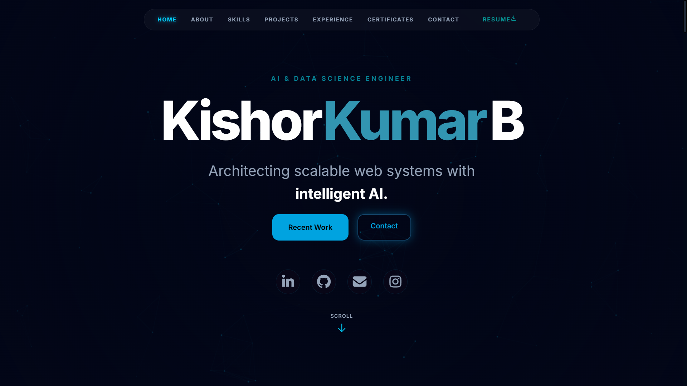

# 👨‍💻 Kishor Kumar — Portfolio
<p align="center"> 
    
</p>


<h3 align="center">Java Full Stack Developer</h3>

<p align="center">  
  Building responsive web applications and scalable backend systems with Java and modern web technologies.
</p>

<p align="center">
  <a href="https://kishorkumar-app.vercel.app/">🌐 Live Portfolio</a> •
  <a href="https://github.com/Kishor165">GitHub</a> •
  <a href="https://linkedin.com/in/kishorkumar28">LinkedIn</a>
</p>

---

## 👋 About Me
Hi, I'm **Kishor Kumar**, a B.Tech graduate in **Artificial Intelligence & Data Science** with a strong focus on **Java Full Stack Development**.

I enjoy building web applications, developing backend APIs, working with databases, and creating clean and responsive user interfaces.

Currently, I am strengthening my skills in **Java, Spring Boot, REST APIs, React, MySQL, JDBC, Servlets, and Data Structures & Algorithms**.

---


## 🛠️ Tech Stack
### Frontend
* HTML5
* CSS3
* JavaScript
* React

### Backend
* Java
* Spring Boot
* JDBC
* Servlets
* REST APIs


### Database
* MySQL


### Programming & Concepts
* Core Java
* OOP
* Collections
* Exception Handling
* Multithreading
* Data Structures & Algorithms

### Tools
* Git
* GitHub
* VS Code
* Eclipse
* Postman

---

## 🚀 Featured Projects

### 🍔 Online Food Ordering System

A web-based food ordering application that allows users to browse restaurants and dishes, search for food, manage profiles, and place orders.

**Technologies:** HTML, CSS, JavaScript, Firebase, EmailJS

**Repository:**

https://github.com/Kishor165/ONLINE-FOOD-DELIVERY-SYSTEM

---

### 🤖 Meeting Summarizer

An AI-powered application that converts meeting audio into text and generates summarized notes. It also provides question-answer functionality based on the meeting content.

**Technologies:** Python, Flask, JavaScript, OpenAI Whisper, Google Gemini, PyPDF2, python-docx

**Repository:**
https://github.com/Kishor165/Meeting-Summarizer

---

### 🛒 Amazon Clone

A frontend e-commerce project created to practice webpage structure, responsive design, styling, and JavaScript-based interactions.

**Technologies:** HTML, CSS, JavaScript

**Repository:**
https://github.com/Kishor165/Amazon_clone_page

---

## 📚 Currently Learning

```text
Java
 ├── Advanced Java
 ├── JDBC
 ├── Servlets
 └── Spring Boot
      └── REST APIs

Frontend
 ├── HTML
 ├── CSS
 ├── JavaScript
 └── React

Database
 └── MySQL

Problem Solving
 └── Data Structures & Algorithms
```

---

## 🎯 Career Focus

I'm currently looking for opportunities as a:

* Java Full Stack Developer
* Java Developer
* Backend Developer
* Software Developer

My primary focus is on building **real-world applications using Java, Spring Boot, React, REST APIs, and MySQL**.

---

## 📊 GitHub

<p align="center">
  <a href="https://github.com/Kishor165">
    
  </a>
</p>

---


## 🤝 Connect With Me

<p align="left">
  <a href="https://linkedin.com/in/kishorkumar28">LinkedIn</a> •
  <a href="https://github.com/Kishor165">GitHub</a> •
  <a href="https://kishorkumar-app.vercel.app/">Portfolio</a>
</p>

---


<p align="center">
  ⭐ Thanks for visiting my portfolio repository!
</p>
